# Important API flows

These sequence diagrams show the implemented call paths, data stores, filters, failure branches, and transaction boundaries. Component definitions are in [architecture.md](architecture.md); entity relationships are in [data-model.md](data-model.md).

## 1. Registration

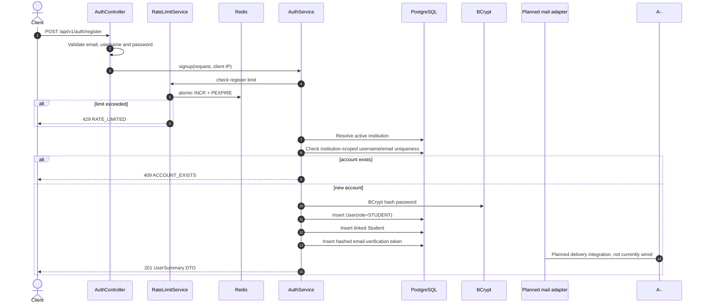

Public registration cannot select an administrative role. The raw verification token is not returned or logged. A mail adapter/event handoff is still required; token delivery is not currently wired.

## 2. Login and access-session creation

```mermaid
sequenceDiagram
    autonumber
    actor Client
    participant C as AuthController
    participant RL as RateLimitService
    participant R as Redis
    participant A as AuthService
    participant PG as PostgreSQL
    participant B as BCrypt
    participant J as JwtUtil

    Client->>C: POST /api/v1/auth/login
    C->>C: Bean Validation
    C->>A: login(identifier, password, institutionCode, IP)
    A->>RL: check login:{IP}:{identifier}
    RL->>R: atomic counter, 15-minute TTL
    alt over 10 attempts
        A-->>Client: 429 RATE_LIMITED
    end
    A->>PG: Resolve institution and find user by username/email
    A->>B: matches(rawPassword, passwordHash)
    alt missing, inactive, or password mismatch
        A-->>Client: 401 INVALID_CREDENTIALS
    else credentials valid
        rect rgb(235, 245, 255)
            Note over A,PG: Transactional session issuance
            A->>PG: Insert SHA-256 hashed refresh token
            A->>J: Generate signed JWT with uid, iid, role and jti
            A->>R: SET active access session with JWT TTL
        end
        alt Redis write fails
            Note over A,PG: Authentication fails; DB transaction rolls back
            A-->>Client: 500; no usable session is issued
        else session created
            A-->>C: access token + user DTO + raw refresh token
            C-->>Client: 200 JSON + HttpOnly refresh cookie
        end
    end
```

The JWT itself is not stored as the Redis value. Redis stores an `active` marker keyed by institution, user, and JTI, avoiding token disclosure in cache data.

Login scenario matrix:

| Scenario | Components reached | Result |
|---|---|---|
| Malformed or missing request fields | Controller validation | `400 VALIDATION_FAILED` |
| Rate window exceeded | `RateLimitService` and Redis | `429 RATE_LIMITED` before password work |
| Institution/account missing | `AuthService` and PostgreSQL | `401 INVALID_CREDENTIALS` |
| User inactive | `AuthService` and PostgreSQL | `401 INVALID_CREDENTIALS` |
| Wrong password | PostgreSQL lookup and BCrypt | `401 INVALID_CREDENTIALS` |
| Redis unavailable during rate check/session registration | Redis and exception translation | Request fails; no usable authenticated session is returned |
| Valid credentials | PostgreSQL, BCrypt, JWT utility and Redis | `200`, access token, user DTO and refresh cookie |

## 3. Bearer-token validation for every protected route

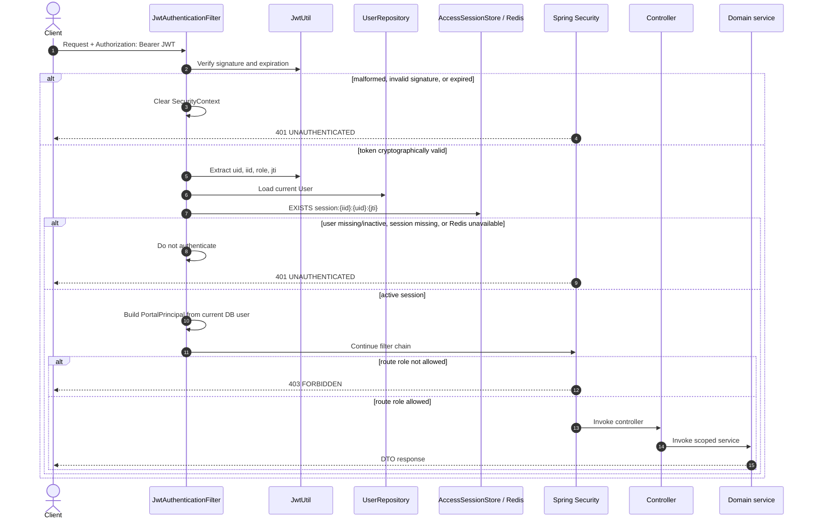

Loading the user on every authenticated request ensures account deactivation and role changes take effect without waiting for JWT expiration. Redis failure is fail-closed for protected routes.

Protected-request scenario matrix:

| Scenario | Decision point | Result |
|---|---|---|
| No bearer token on protected route | Security filter chain | `401 UNAUTHENTICATED` |
| Invalid signature or malformed JWT | `JwtUtil` | `401` |
| Expired JWT | `JwtUtil` | `401` |
| Valid JWT but missing/revoked Redis JTI | `AccessSessionStore` | `401` |
| Redis unavailable | `AccessSessionStore` | Fail closed with `401` for protected route |
| User deleted or inactive | PostgreSQL user lookup | `401` |
| Current DB role cannot access route | Spring Security authorization | `403 FORBIDDEN` |
| Role allowed but resource belongs to another user/institution | Domain service scoped lookup | Safe `404` or `403` |
| All checks pass | Controller and service | DTO response |

## 4. Refresh-token rotation

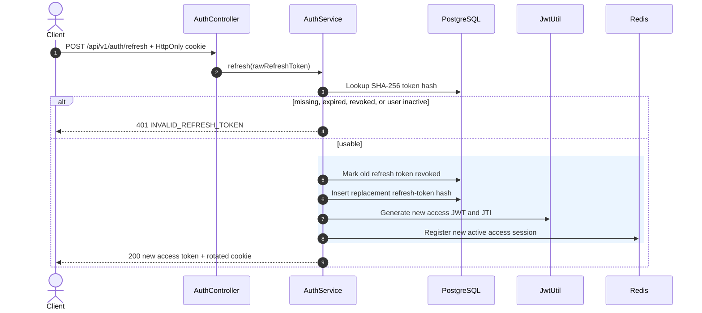

Refresh rotation does not silently delete other active access sessions. Explicit logout revokes the current access session; password reset/change revokes all sessions.

## 5. Logout and immediate JWT rejection

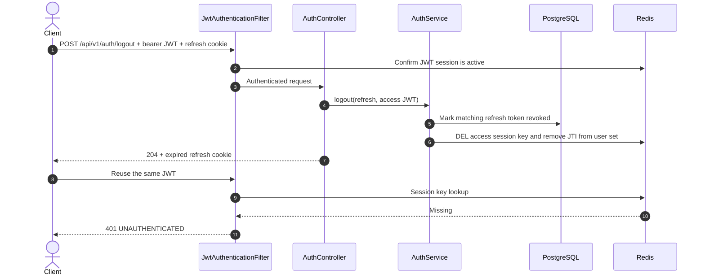

The frontend should send both cookie and bearer token on logout. If it sends only the cookie, refresh is revoked but the current access-session key cannot be identified and remains valid until its short TTL.

## 6. Forgot password, reset password, and verify email

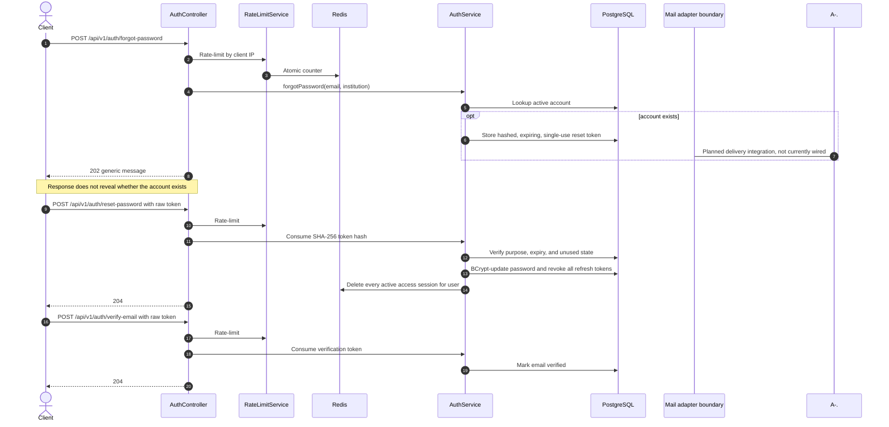

The durable token lifecycle is implemented, but raw reset/verification token delivery is a known integration boundary. A production mail adapter must receive the raw token without logging or persisting it in plaintext.

## 7. `/me` routes

### GET `/api/v1/me`

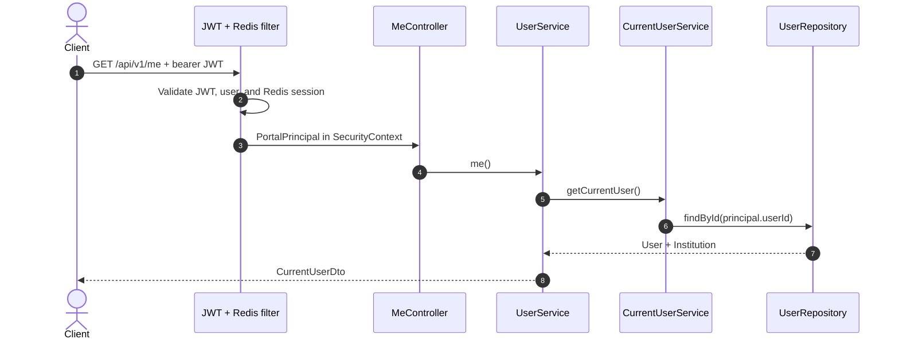

The request never accepts a user ID. Identity always comes from the validated `PortalPrincipal`.

### PATCH `/api/v1/me`

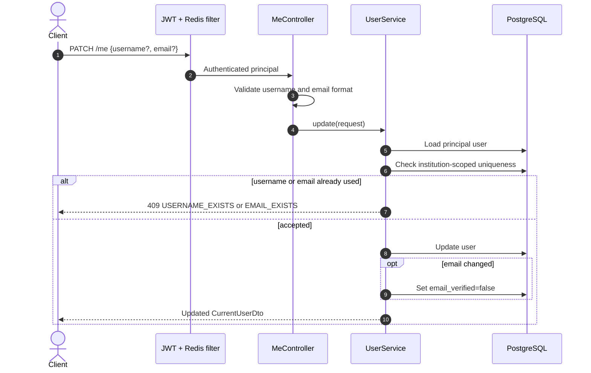

### PUT `/api/v1/me/password`

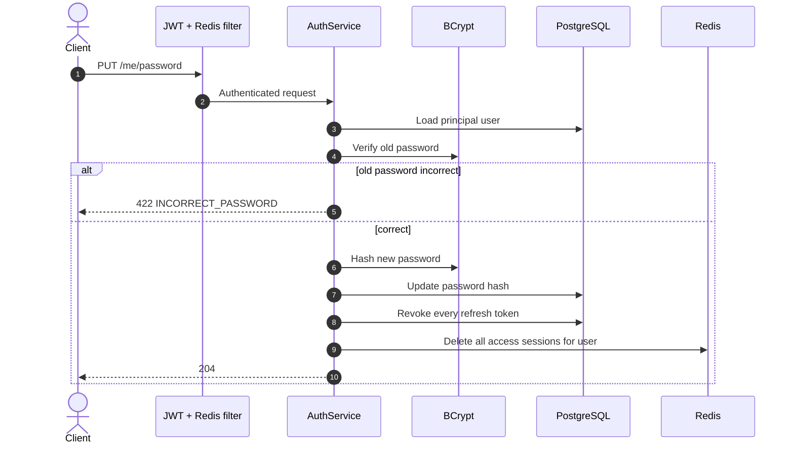

The JWT used for the password-change request becomes invalid immediately after the transaction succeeds.

`/me` scenario matrix:

| Route/scenario | Durable writes | Session effect | Result |
|---|---|---|---|
| `GET /me` | None | None | Current user DTO |
| `PATCH /me` valid username | Update `users.username` | Existing sessions remain active | Updated DTO |
| `PATCH /me` valid email | Update email and set `email_verified=false` | Existing sessions remain active | Updated DTO |
| Duplicate username/email in same institution | None | None | `409` |
| Invalid email/username format | None | None | `400` |
| Password change with wrong old password | None | None | `422 INCORRECT_PASSWORD` |
| Successful password change | Update password; revoke all refresh tokens | Delete every Redis access session | `204`; re-login required |

## 8. Student profile, academics, skills, and completion

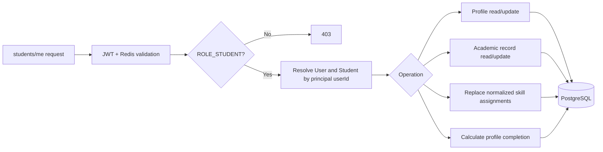

Student self-service routes do not accept `studentId`; therefore a student cannot switch ownership by changing a path parameter. Admin student routes use explicit student IDs but query them with the principal institution ID.

## 9. Document upload and verification

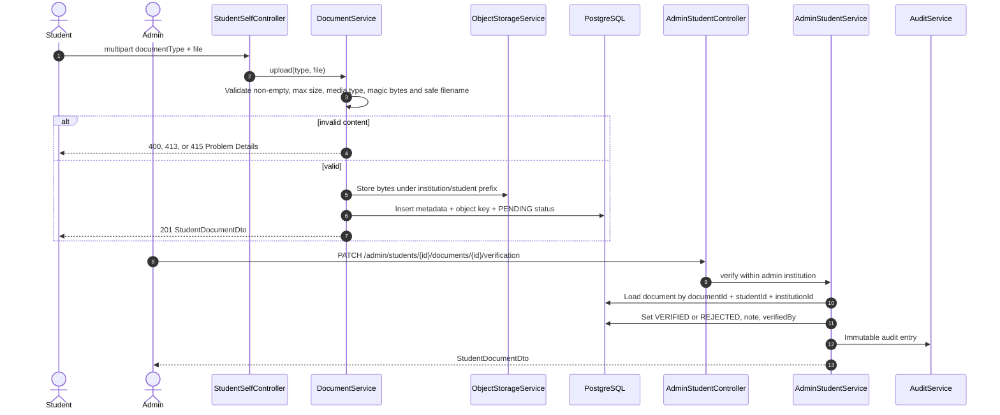

Verified documents cannot be deleted by students. Large file bytes never enter PostgreSQL.

## 10. Drive discovery and eligibility preview

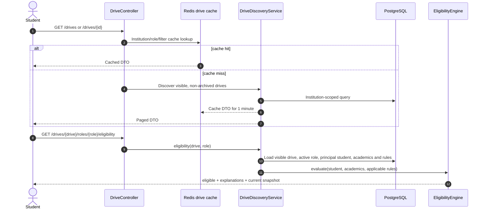

Eligibility previews are not cached because they depend on the current student's academic/profile state.

## 11. Apply to a drive role

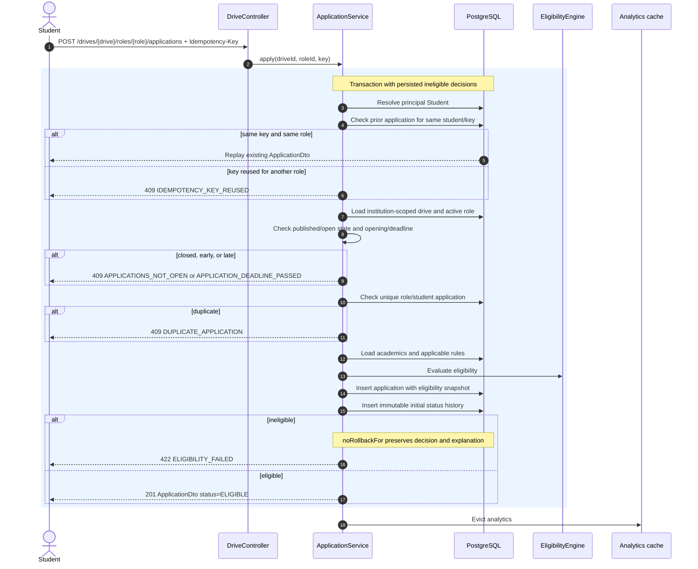

The database partial unique constraint on `(drive_role_id, student_id)` is the final concurrency defense after the service-level duplicate check.

## 12. Admin drive configuration and publication

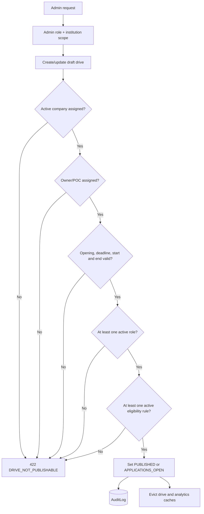

Once a drive moves beyond configurable states, role and rule edits are rejected. Archive/cancel/status transitions preserve historical applications and results.

## 13. Admin application status and bulk imports

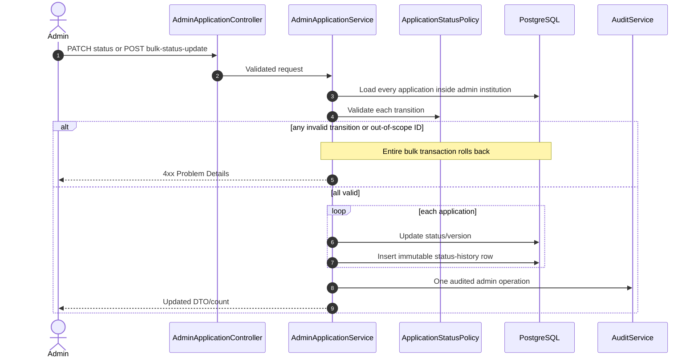

CSV result/student/offer imports require `Idempotency-Key`. The stored idempotency scope is `(institution, actor, operation, key)` plus a request hash. Same key and same bytes replay the response; same key and different bytes returns 409.

## 14. Selection-round result publication

```mermaid
sequenceDiagram
    autonumber
    actor Admin
    participant C as RoundController
    participant R as RoundService
    participant PG as PostgreSQL
    participant N as NotificationService
    participant AU as AuditService

    Admin->>C: POST /admin/drives/{drive}/rounds/{round}/results
    C->>R: saveResults(all participant results)
    R->>PG: Validate round and every participant belongs to it
    R->>PG: Upsert scores, attendance and result status in one transaction
    R->>AU: Audit bulk result update
    R-->>Admin: updated count

    Admin->>C: POST .../publish-results
    C->>R: publish(round)
    R->>PG: Require a result for every participant
    alt any result missing
        R-->>Admin: 422 ROUND_RESULTS_INCOMPLETE; rollback
    else complete
        loop participants
            R->>PG: Mark result published
            R->>PG: Transition application through status policy
            R->>PG: Insert status-history row
            R->>N: Create durable notification
        end
        R->>PG: Mark round resultsPublished=true
        R->>AU: Audit publication
        R-->>Admin: RoundDto
    end
```

## 15. Offer acceptance and placement outcome

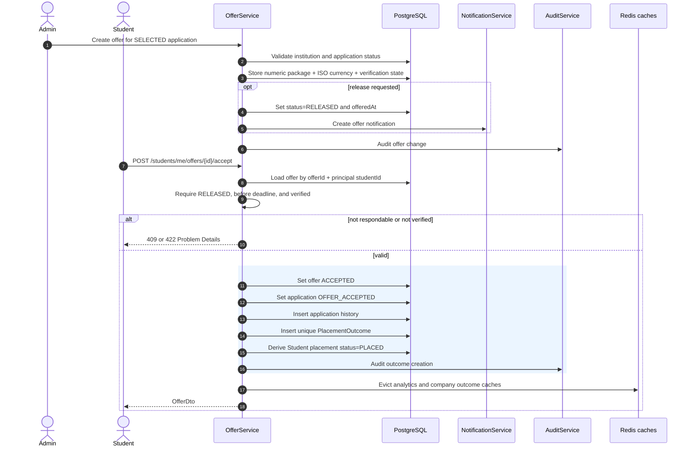

`PLACED` is derived only from a verified accepted offer and a persisted `PlacementOutcome`; it is not inferred from application counts.

## 16. Notifications, announcements, and cache behavior

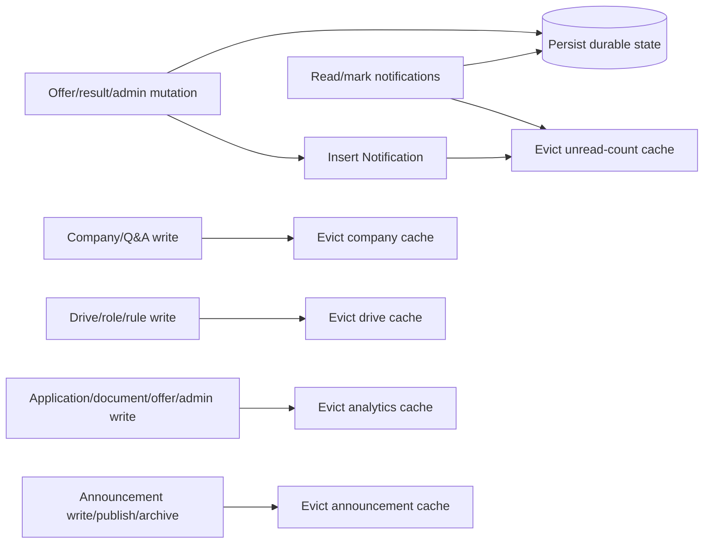

Cache values are DTOs, not managed entities. Cache keys include institution and role, or institution and user for unread counts. Cache eviction may clear all entries in a named cache; this is safe across institutions but can be refined later for performance.

## 17. List and export endpoints

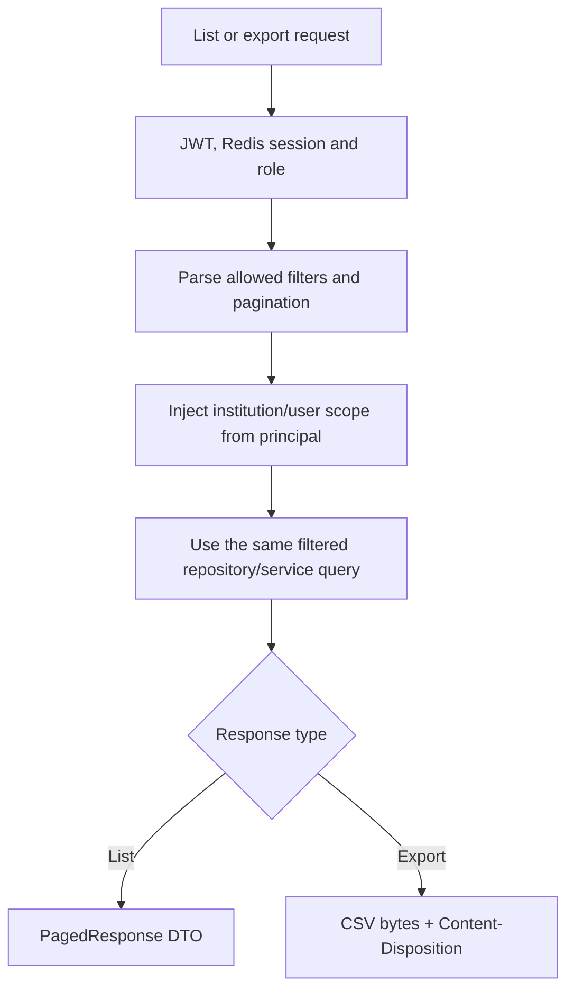

An export does not widen authorization or bypass filters. Student exports and applicant exports reuse the corresponding list-service scope and filter semantics.

## 18. Error translation

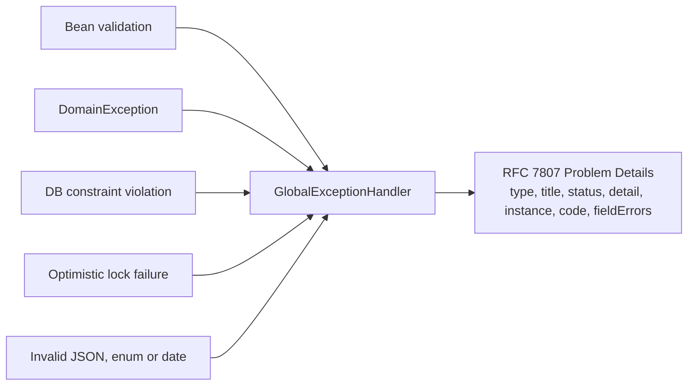

Authentication-entry-point and access-denied failures are also rendered as Problem Details by the security configuration, before a controller is invoked.
