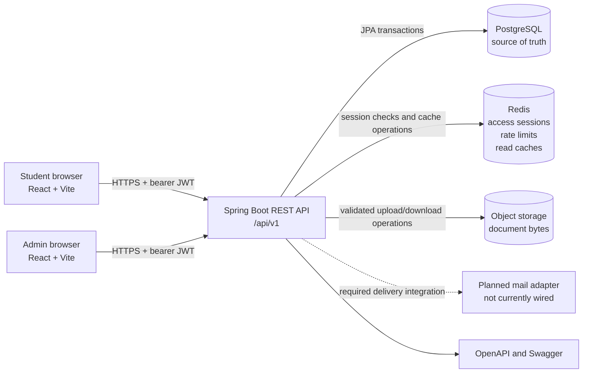
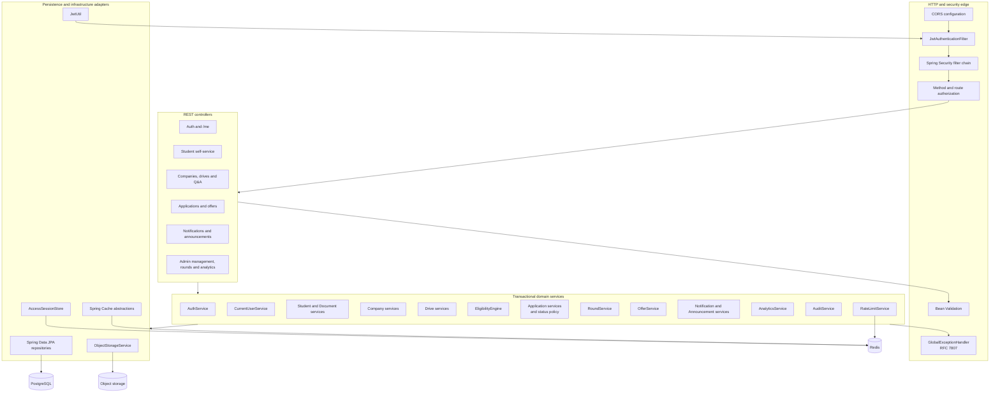
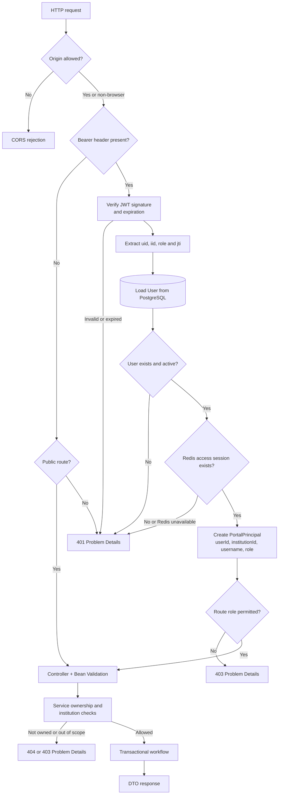
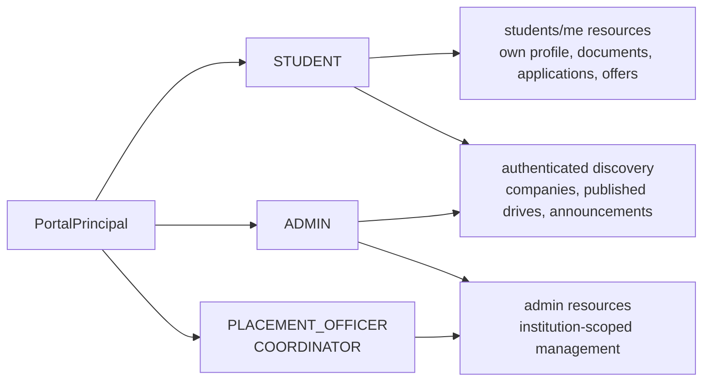
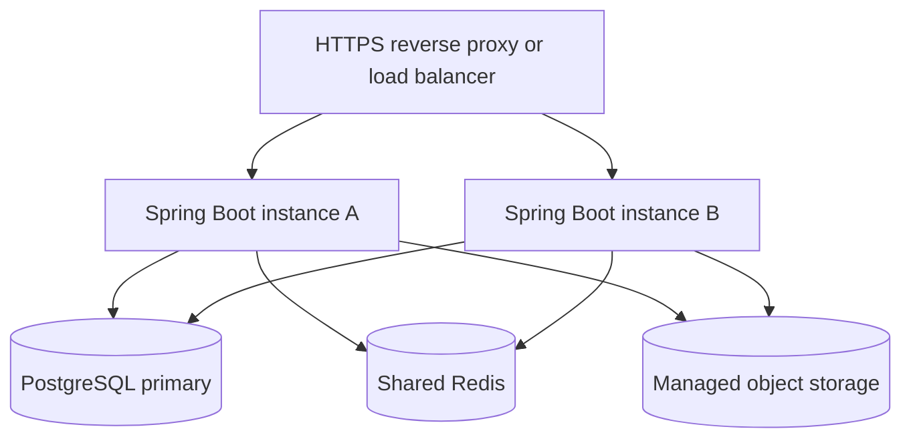

# Placement Portal backend architecture

This document describes the implemented backend, its trust boundaries, component responsibilities, and runtime data stores. Detailed request sequences are in [api-flows.md](api-flows.md), and the relational model is in [data-model.md](data-model.md).

## System context



PostgreSQL owns durable business state. Redis is deliberately not the source of truth for students, drives, applications, offers, or outcomes. It is the authority for whether an access JWT is currently active and is also used for distributed counters and disposable read caches. Object storage owns file bytes; PostgreSQL stores only document metadata and object keys.

## Internal component layers



Controllers accept validated request DTOs and return response DTOs. They do not expose JPA entities. Services enforce ownership, institution scope, state transitions, deadlines, idempotency, and transaction boundaries. Repositories perform filtered persistence operations but are not treated as authorization boundaries.

## Authenticated request pipeline



The route-level checks and service-level checks solve different problems:

- Spring Security decides whether a role may enter a route family.
- Services prevent IDOR by resolving owner resources from `PortalPrincipal` or querying by both resource ID and institution/user ID.
- Repository filters support those checks but never replace them.

## Authorization model



All tenant-aware records are scoped by `institutionId`. `PLACEMENT_OFFICER` and `COORDINATOR` are already accepted by the admin route family so delegated roles can be refined later without redesigning authentication.

## Runtime state ownership

| State | Owner | Retention and behavior |
|---|---|---|
| Users, profiles, academics, drives, applications, offers and outcomes | PostgreSQL | Durable, transactionally updated, migrated by Flyway |
| Hashed refresh tokens | PostgreSQL | Durable, rotated on refresh and revoked on logout/password reset |
| Active access JWT sessions | Redis | Keyed by institution, user and JTI; TTL equals JWT lifetime |
| Login/reset/verification counters | Redis | Atomic fixed-window counters; keys hash identifying input |
| Companies, drives, analytics and announcements cache | Redis | Institution/role scoped and evicted after relevant mutations |
| Unread notification count cache | Redis | Institution/user scoped; evicted on notify/read operations |
| Resume/document bytes | Object storage | Validated before upload; only metadata/object key is in PostgreSQL |
| Audit history and application status history | PostgreSQL | Append-oriented permanent records |

## Redis key families

```text
placement:auth:session:{institutionId}:{userId}:{jti}
placement:auth:user-sessions:{institutionId}:{userId}
placement:rate-limit:{sha256-of-logical-key}
companies::{institution-and-role-aware-cache-key}
drives::{institution-and-role-aware-cache-key}
analytics::{institution-and-role-aware-cache-key}
announcements::{institution-and-role-aware-cache-key}
notification-unread::{institution-and-user-aware-cache-key}
```

The user-session set permits logout-all/password-reset revocation without using the Redis `KEYS` command. If Redis is unavailable, protected requests fail closed because the session cannot be proven active. `APP_REDIS_ENABLED=false` selects explicit single-process in-memory implementations only for tests and isolated development.

## Component catalog

| Area | Controllers | Primary services | Main durable records |
|---|---|---|---|
| Identity | `AuthController`, `MeController` | `AuthService`, `UserService`, `CurrentUserService`, `RateLimitService` | `Institution`, `User`, `RefreshToken`, `PasswordResetToken` |
| Student self-service | `StudentSelfController`, `StudentEventController` | `StudentService`, `DocumentService`, `StudentEventService` | `Student`, `AcademicRecord`, `Skill`, `StudentSkill`, `StudentDocument` |
| Companies and Q&A | `CompanyController`, `AdminCompanyController` | `CompanyService`, `AdminCompanyService` | `Company`, `CompanyContact`, `CompanyFaq`, `CompanyQuestion`, `QuestionReply` |
| Drives and applications | `DriveController`, `AdminDriveController`, `StudentApplicationController`, `AdminApplicationController` | `DriveDiscoveryService`, `AdminDriveService`, `EligibilityEngine`, `ApplicationService`, `AdminApplicationService`, `ApplicationStatusPolicy` | `CampusDrive`, `DriveRole`, `EligibilityRule`, `JobApplication`, `ApplicationStatusHistory` |
| Selection and placement | `RoundController`, `OfferController` | `RoundService`, `OfferService` | `SelectionRound`, `RoundParticipant`, `RoundResult`, `Offer`, `PlacementOutcome` |
| Communications | `CommunicationController` | `NotificationService`, `AnnouncementService` | `Notification`, `Announcement` |
| Administration | Admin controllers and analytics controller | `AdminStudentService`, `AnalyticsService`, `AuditService` | `AuditLog`, `IdempotencyRecord` plus domain records above |
| Infrastructure | Security/configuration classes | `ObjectStorageService`, `LocalObjectStorageService` | Redis state and external object bytes |

## Cross-cutting consistency rules

- Services that change applications, round results, offers, or drive configuration are transactional.
- Application eligibility is evaluated server-side and copied into an immutable application snapshot.
- Every application status change creates a separate history row.
- Frequently edited drives, applications, documents, rounds, offers, and other audited records use optimistic versions.
- Published drives, applications, results, offers, companies, and announcements use state transitions or archive flags instead of destructive deletion where history matters.
- CSV exports reuse the same institution scope and filters as list operations.
- Domain, validation, security, malformed request, integrity, and optimistic locking failures are returned as RFC 7807 Problem Details.

## Deployment view



Because access sessions and rate counters are shared in Redis, a JWT issued by instance A can be validated or revoked by instance B. PostgreSQL constraints remain the final defense for duplicates and referential integrity.
