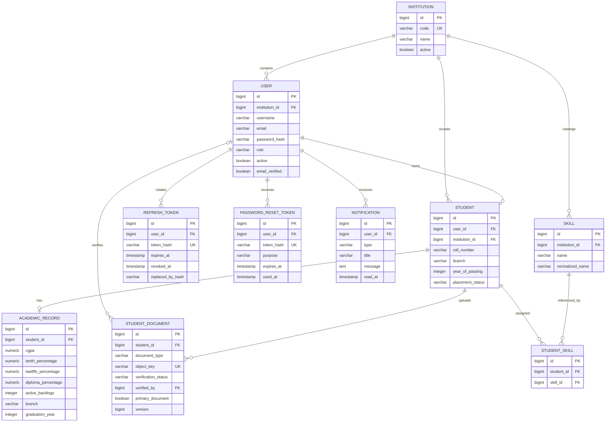
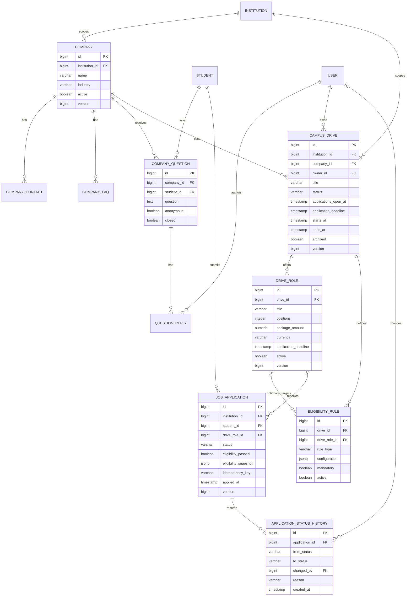
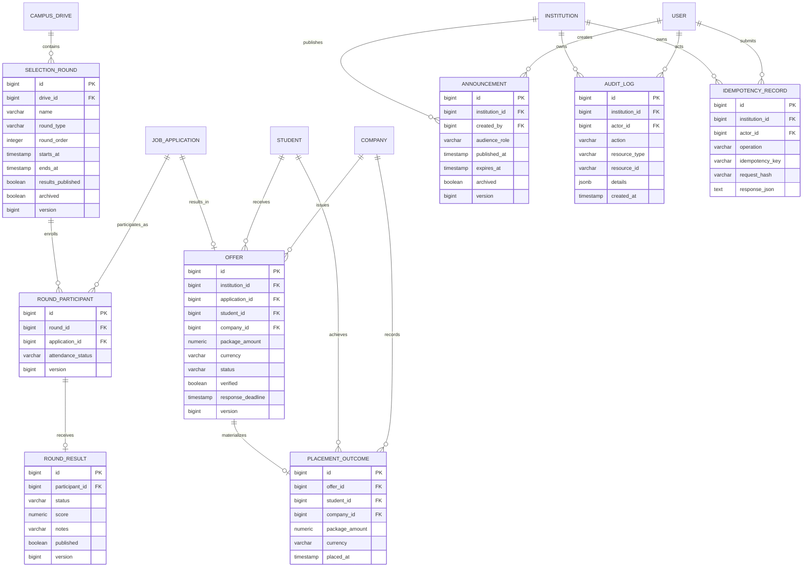
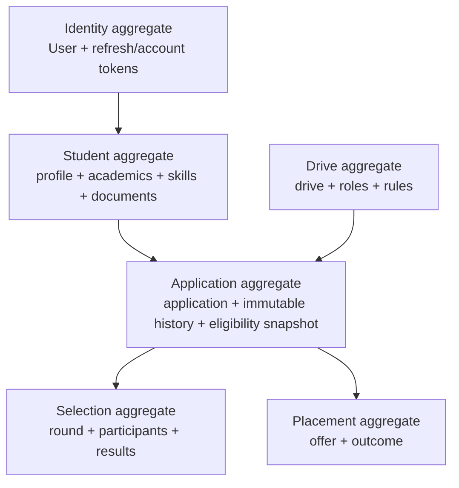

# Domain data model

This document groups the implemented PostgreSQL model into readable diagrams. `JobApplication` is the Java/entity name retained for compatibility; it represents the product's application aggregate.

## Identity and student records



Important constraints:

- Username and email are unique case-insensitively inside an institution, not globally.
- A `User` has at most one `Student` record.
- Roll number is unique case-insensitively inside an institution when present.
- A student has at most one academic record and one primary resume.
- `StudentSkill` is unique by `(student_id, skill_id)`.
- Only refresh/account token hashes are stored; raw tokens are not persisted.

## Companies, drives, and applications



Important constraints and invariants:

- Company names are unique inside an institution.
- A drive belongs to one institution and optionally references its company/owner while in draft.
- Eligibility rules use JSONB only for flexible rule configuration; the drive, role, application, and academic model remain relational.
- An eligibility rule may apply to the whole drive or a particular role.
- `(drive_role_id, student_id)` is unique for applications.
- `(student_id, idempotency_key)` is unique when an application idempotency key is supplied.
- Eligibility snapshot JSONB is immutable evidence of the input/rule decision at application time.
- Status history is append-only from the domain workflow perspective.

## Rounds, offers, outcomes, and administration



Important constraints and invariants:

- Round order is unique inside a drive.
- A given application participates at most once in a round.
- A participant has at most one result.
- An application has at most one offer in the current model.
- An offer has at most one placement outcome.
- Package values are numeric and currency is a separate three-letter code.
- Placement outcome creation requires a verified, accepted offer; this is what derives the student's placed status.
- Idempotency records are unique by `(institution, actor, operation, idempotency_key)` and store a request hash for mismatch detection.
- Audit logs record sensitive administrative mutations without storing credentials, tokens, or document bytes.

## Aggregate and transaction boundaries



- Changes within a workflow occur through services rather than direct controller/repository composition.
- Database unique constraints protect the final write against races after service pre-checks.
- Optimistic `version` columns detect lost updates for frequently edited records.
- Audit and history rows are written in the same transaction as the sensitive state change.
- Notifications generated by result/offer workflows are durable PostgreSQL rows; Redis only accelerates unread counts.

## Institution-scope rule

The institution ID is carried in the authenticated `PortalPrincipal`, but services still obtain current records from PostgreSQL and query protected resources with an institution or owner predicate. A client-supplied institution ID is never trusted to widen access.

```text
Student self-service: principal.userId -> Student -> owned record
Admin resource:       principal.institutionId + requested resourceId -> scoped record
Shared discovery:     principal.institutionId + visible/published state -> DTO
```
